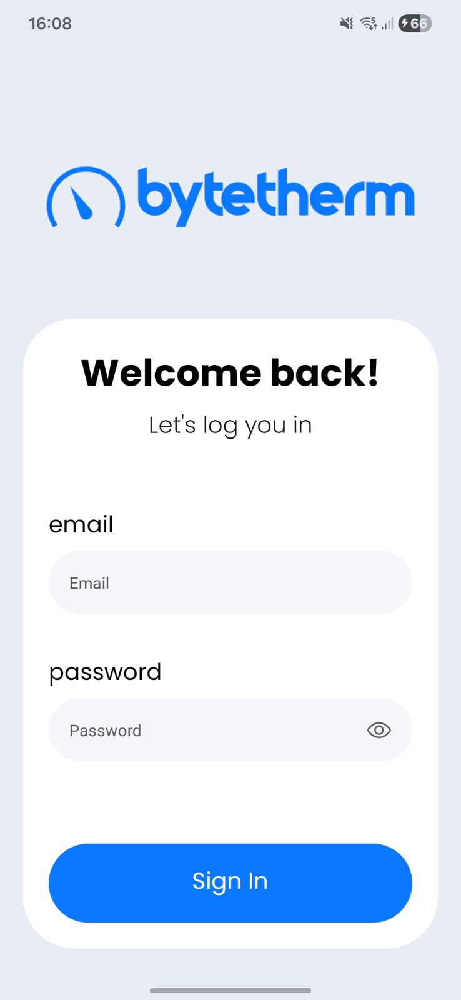
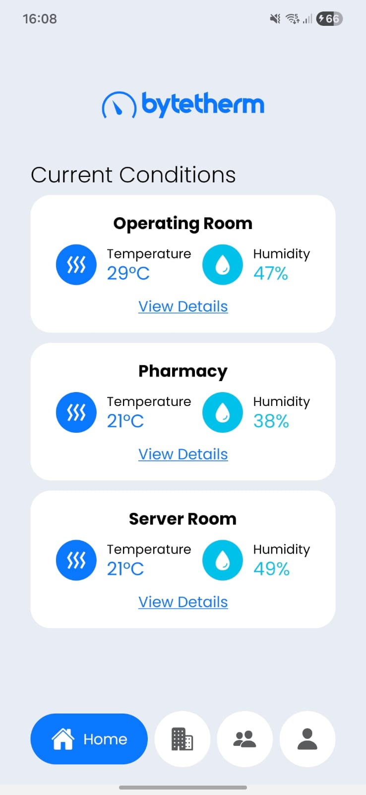
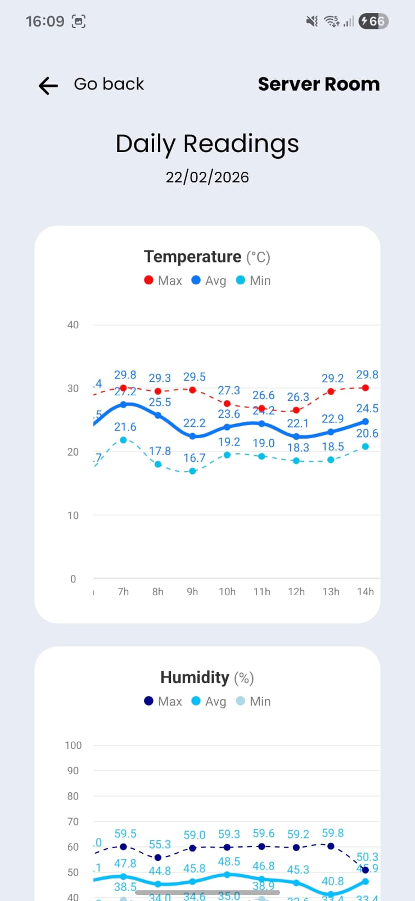
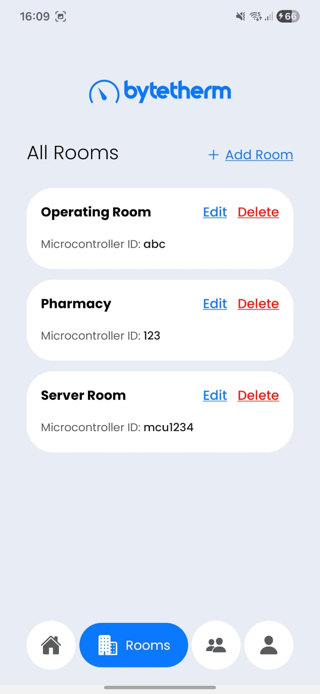
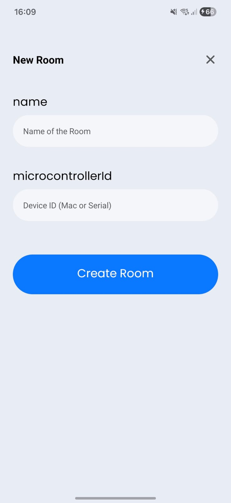
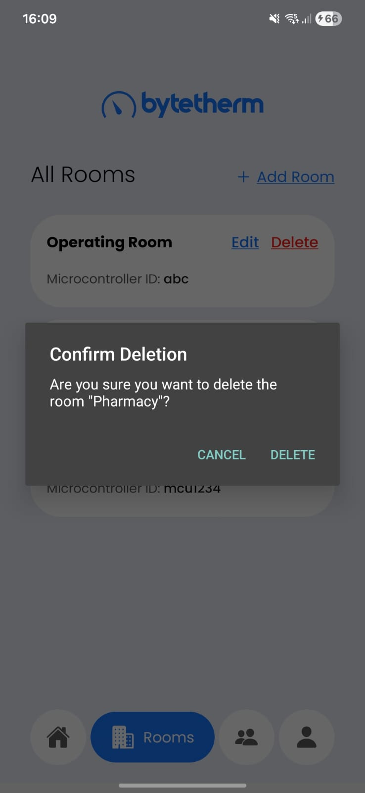
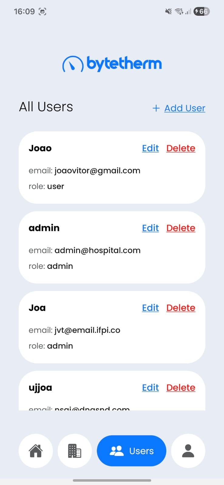
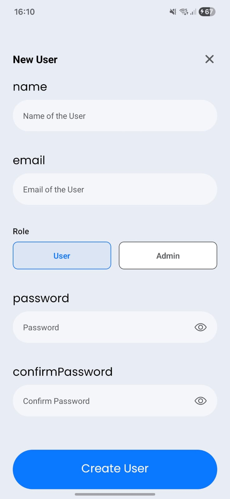
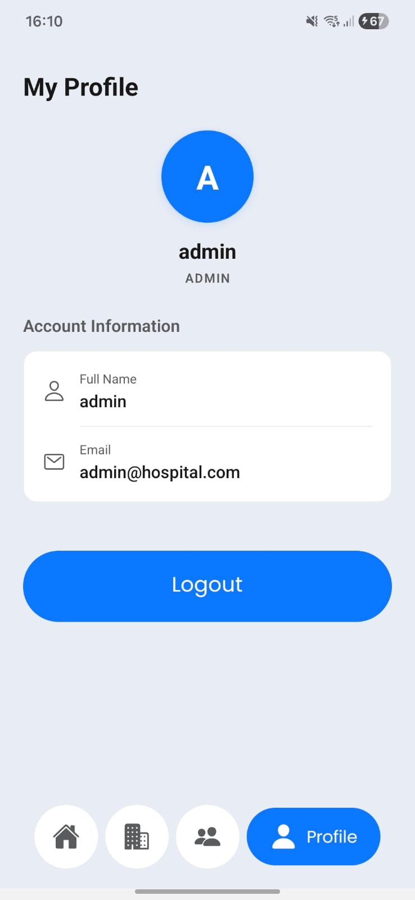

  

<h1 align="center">ByteTherm - IoT Mobile Dashboard 🌡️💧</h1>

> A React Native mobile application for real-time monitoring of temperature and humidity in critical environments.

This project was developed as part of a Technological Residency in Embedded Systems. It serves as the mobile interface for an end-to-end IoT ecosystem.

## 📖 About the Project

ByteTherm provides an interface to monitor environmental data collected by ESP8266 microcontrollers. In the physical environment, the microcontrollers use local sensors, an LCD, an LED, and a buzzer to immediately alert personnel if safe thresholds are exceeded. 

Simultaneously, the hardware publishes this data via MQTT to a backend server, which this mobile application consumes via a REST API to provide remote tracking, historical data, and status monitoring.

## 🔄 System Architecture & Flow

1. **Edge (Hardware):** ESP8266 reads temp/humidity -> Validates thresholds -> Sends data via MQTT.
2. **Backend (Node.js):** Subscribes to MQTT -> Processes and stores data -> Exposes a REST API.
3. **Client (ByteTherm):** Fetches data via REST API -> Displays interactive UI to the user.

*Note: The backend server handling the MQTT broker and REST API can be found in a separate repository here: [Backend-server](https://github.com/Vitor-Silva27/Projetos/tree/main/monitoramento-de-temperatura/server)*

## 📱 Screenshots

  
  &nbsp;&nbsp;&nbsp;
  
  &nbsp;&nbsp;&nbsp;
  
  &nbsp;&nbsp;&nbsp;
  
    &nbsp;&nbsp;&nbsp;
  
    &nbsp;&nbsp;&nbsp;
  
    &nbsp;&nbsp;&nbsp;
  
    &nbsp;&nbsp;&nbsp;
  
    &nbsp;&nbsp;&nbsp;
  
    &nbsp;&nbsp;&nbsp;
  

## 🛠️ Tech Stack

* **Framework:** React Native
* **Language:** TypeScript
* **Routing:** React Navigation
* **Data Fetching & Caching:** React Query (`@tanstack/react-query`) & Axios
* **Local Storage:** `react-native-mmkv`
* **Schema Validation:** Zod